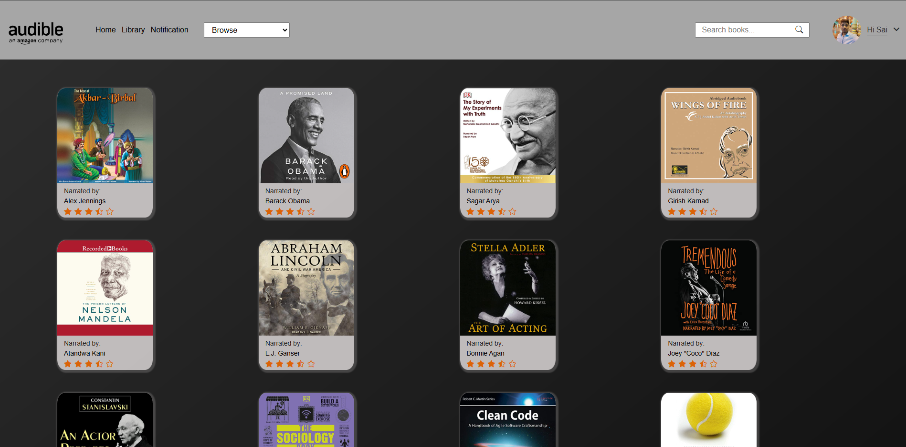

# Audible Clone Website
***

A website where users can register, browse categories, search audiobooks, purchase, and listen to them, with notifications for new releases.

# Technology Stack
***
- Frontend: Angular, TypeScript
- Backend: Java, Spring Boot, Kafka and Elastic Search
- Database: MongoDB

# Frontend
***

### Development Server

Run the following command to start a development server:

```bash
ng serve --o
```


# Backend
***

### 1. Kafka Server
1. Zookeeper

  --> Run command from kafka location
  
    .\bin\windows\zookeeper-server-start.bat .\config\zookeeper.properties
         
2. Kafka

  --> Run command from kafka location
  
    .\bin\windows\kafka-server-start.bat .\config\server.properties
  
### 2. Elastic Search
- Click elasticsearch.bat file in bin folder to start.

